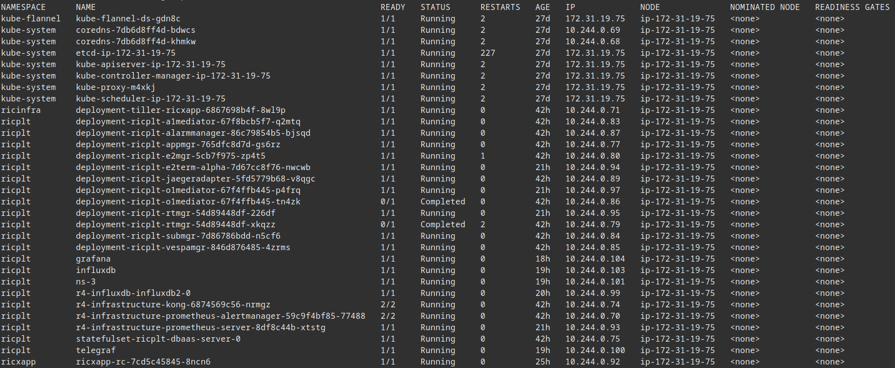
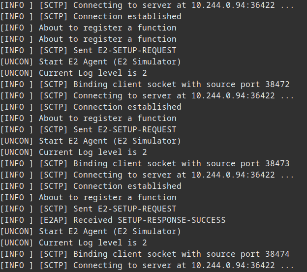
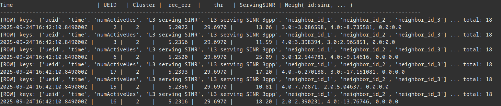
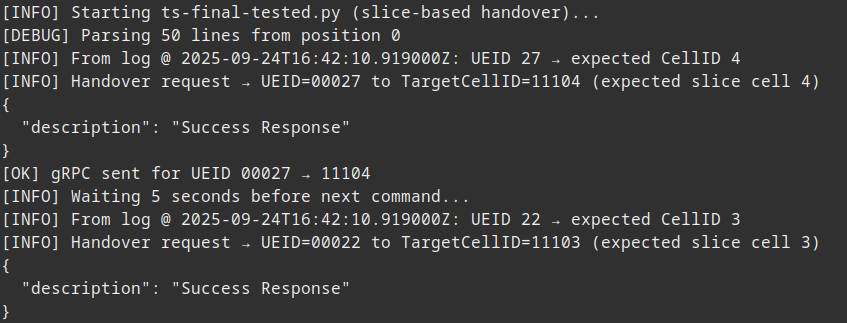
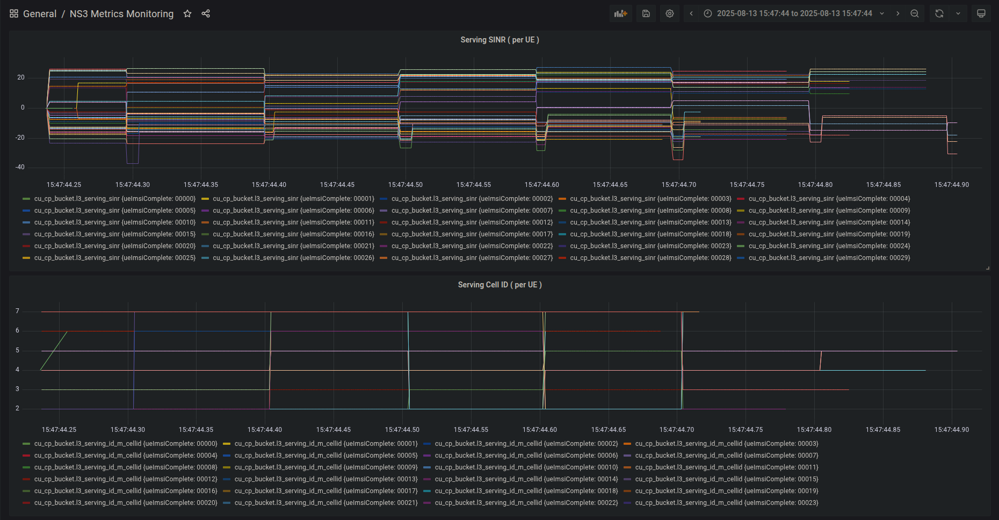
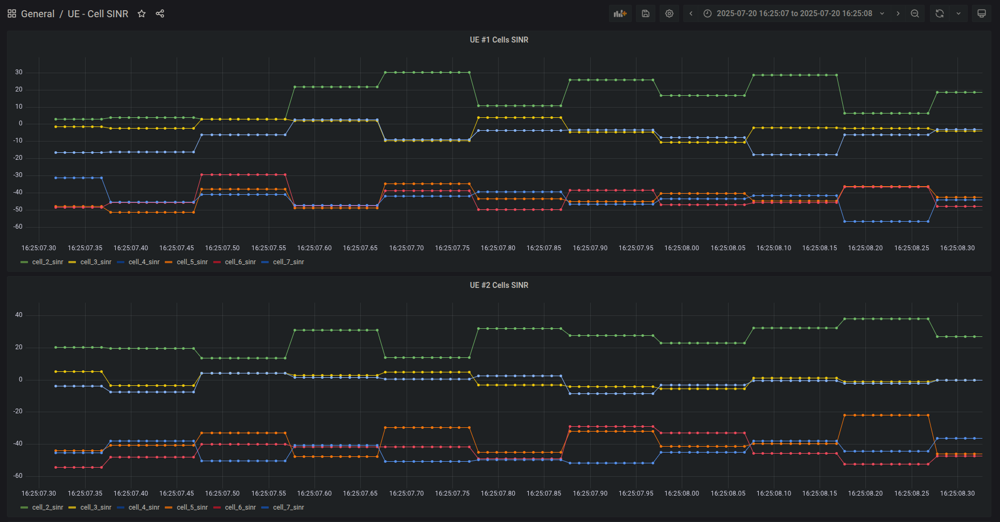

# 6g-TC-nsORAN


[](https://opensource.org/licenses/MIT)


This repository provides our **ns-O-RAN–based simulation framework** for generating **slice-aware datasets** used to train ML models for **Traffic Classification (TC)** and **Abnormal Behavior Detection (ABD)**.

It guides you step by step through:
- Deploying a fully operational **Kubernetes cluster**  
- Running **ns-O-RAN RIC pods**  
- Building and deploying our enhanced version of [ns-o-ran-grafana](https://github.com/wineslab/ns-o-ran-grafana/tree/dev)  
- Launching the new **ABD and TC service**

## 📖 Overview

Testbeds such as **OAI** and **Eurecom** do not natively support **full slicing** or **abnormal condition simulation**. To overcome this, we extended **ns-3** and **ns-O-RAN** modules to model the following network slices:

- **eMBB** – Enhanced Mobile Broadband  
- **URLLC** – Ultra-Reliable Low-Latency Communications  
- **mMTC** – Massive Machine-Type Communications  

In addition, we inject **realistic anomalies**, such as:
- Degraded link quality  
- Fluctuating traffic load  
- Misconfigurations  

The resulting datasets capture **multi-layer KPIs** (RRC, MAC, PHY) across slices and users. These datasets form the **foundation of our ML pipeline** for both **Traffic Classification** and **Abnormal Behavior Detection**.

## ✨ Key Features

- **3GPP-aligned RAN stack simulation** with full **O-RAN E2 interface** support  
- **Configurable slices**: eMBB, URLLC, and mMTC with heterogeneous traffic models  
- **Labeled dataset generation** tailored for ML model training and evaluation  
- **Anomaly injection framework** to support robust ABD model development  
- **End-to-end Kubernetes deployment** of the ns-O-RAN ecosystem  
- **Enhanced Grafana dashboards** for KPI monitoring and visualization  

## 📂 Repository Contents

- **Deployment scripts & guides** – Bash files and documentation for Kubernetes cluster setup and RIC pod deployment  
- **Enhanced ns-3 modules** – Source code and documentation for the extended ns-3 + ns-O-RAN project  
- **ABD and TC service** – Source code and sample datasets for the Abnormal Behavior Detection and Traffic Classification modules

## 🛠️ Prerequisites

Before setting up the environment, ensure you have the following installed and configured:

- **Git** – for cloning and managing repositories  
- Adequate system resources (**multi-core CPU, 16GB+ RAM, and sufficient storage**) to host the Kubernetes cluster and run multiple containers  

## ⎈ Kubernetes Setup

Follow these steps to set up the full Kubernetes infrastructure:

### 1. Install Docker 

If Docker is not already installed, you can install the latest version of **Docker** and **Containerd** by running:

``` Bash
cd installation_bash
chmod +x install-docker.sh
./install-docker.sh
```

### 2. Install CRI Tools

You can install and configure **cri-tools** using:

``` Bash
cd installation_bash
chmod +x install-crictl.sh
./install-crictl.sh
```

### 3. Configure Containerd

To properly configure **containerd**, run:

``` Bash
cd installation_bash
chmod +x config-containerd.sh
./config-containerd.sh
```

### 4. Install Kubernetes Cluster and Helm

To install the **Kubernetes** cluster along with **Helm**, use:

``` Bash
cd installation_bash
chmod +x install-k8s-helm.sh
./install-k8s-helm.sh
```

This script will:
- Pull the required pod images  
- Configure the cluster control plane  
- Set up local storage  
- Load the core Kubernetes pods into a single-node cluster  

### 5. Deploy Helm3 Common Templates

After the Kubernetes cluster is up and running, install the Chart Manager and common templates for Helm3 using:

``` Bash
cd installation_bash
chmod +x install-common-templates-helm.sh
./install-common-templates-helm.sh
```

## 🚀 Build Services

To deploy the services on Kubernetes, follow these steps:

### 1. Deploy ns-O-RAN RIC Pods

Setting up the **ns-O-RAN RIC** infrastructure requires several steps.

#### 1.1 Pull Required Images 

Load all required images into the **containerd** environment:

``` Bash
cd ns-o-ran_ric_bash
chmod +x pull-images.sh
./pull-images.sh
```

#### 1.2 Configure InfluxDB

InfluxDB requires a one-time installation and configuration:

``` Bash
kubectl create ns ricinfra
helm repo add stable https://charts.helm.sh/stable
helm install nfs-release-1 stable/nfs-server-provisioner --namespace ricinfra
kubectl patch storageclass nfs -p '{"metadata": {"annotations":{"storageclass.kubernetes.io/is-default-class":"true"}}}'
sudo apt install nfs-common
```

#### 1.3 Deploy Pods

Before deployment, modify the recipe-oran.yaml file:

``` Bash
cd ns-o-ran_ric_bash
nano recipe-oran.yaml
```

Update the following lines with your host machine IP address:

```
ricip: "10.0.0.1"
auxip: "10.0.0.1"
```

Then deploy all RIC components to the Kubernetes cluster:

``` Bash
cd ns-o-ran_ric_bash
chmod +x install-oran.sh
./install-oran.sh -f ./recipe-oran.yaml -c "jaegeradapter influxdb"
```

> **Note**:  
> After installation, verify the status of the **`r4-influxdb-influxdb2-0`** pod.  
> If it remains stuck in a **Pending** state, reset the PersistentVolume (PV) and PersistentVolumeClaim (PVC) with the following steps:

``` Bash
kubectl delete pv -n ricplt ricplt-influxdb
kubectl delete pvc r4-influxdb-influxdb2 -n ricplt
cd ns-o-ran_ric_bash
kubectl apply -f influxdb-pv.yaml
kubectl apply -f influxdb-pvc-sc.yaml
```

#### 1.4 Configure Kong

Patch the Kong service with your **host IP** address:

``` Bash
kubectl patch svc -n ricplt r4-infrastructure-kong-proxy -p '{"spec": {"externalIPs": ["10.0.0.1"]}}'
```

#### 1.5 Install and Deploy RC xApp

To install and deploy the **RC xApp**, follow these steps:

**Step 1 - Clone the App Manager repository**

``` Bash
git clone https://github.com/aliasadi2001/appmgr.git
```

**Step 2 - Run ChartMuseum**

``` Bash
docker run --rm -u 0 -it -d -p 8090:8080 \
  -e DEBUG=1 \
  -e STORAGE=local \
  -e STORAGE_LOCAL_ROOTDIR=/charts \
  -v $(pwd)/charts:/charts \
  chartmuseum/chartmuseum:latest

export CHART_REPO_URL=http://0.0.0.0:8090
```

**Step 3 - Install dms_cli**

``` Bash
cd appmgr/xapp_orchestrater/dev/xapp_onboarder
apt-get install python3-pip
apt-get install python3-testresources
pip3 uninstall xapp_onboarder
pip3 install ./
chmod 755 /usr/local/bin/dms_cli
```

**Step 4 - Clone the RC xApp repository**

``` Bash
git clone https://github.com/wineslab/ns-o-ran-xapp-rc.git
```

**Step 5 - Run the Docker registry**

``` Bash
docker run -d -p 5000:5000 --name registry registry:2
```

**Step 6 - Update the launch_app.sh script**

Inside the **rc xApp directory**, replace the contents of `launch_app.sh` with:

``` Bash
#!/bin/bash
#set -x

export CHART_REPO_URL=http://0.0.0.0:8090

dms_cli uninstall rc ricxapp

docker build . -f Dockerfile -t 127.0.0.1:5000/rc:1.0.0 # --no-cache

docker push 127.0.0.1:5000/rc:1.0.0

dms_cli onboard /home/ubuntu/ns-o-ran-xapp-rc/xapp-descriptor/config.json \
                /home/ubuntu/ns-o-ran-xapp-rc/xapp-descriptor/schema.json

dms_cli install rc 1.0.0 ricxapp

echo "Wait for 10 seconds"
sleep 10

unset pod_name
pod_name=$(kubectl get pods -n ricxapp --no-headers -o custom-columns=":metadata.name")

echo "To enter the pod shell, run:"
echo kubectl exec -ti -n ricxapp $pod_name bash

# Example: run the KPI Monitor
# ./kpimon -f /opt/ric/config/config-file.json
```

**Step 7 - Deploy the RC xApp**

``` Bash
./launch_app.sh
```

### 2. Deploy NS3 + InfluxDB + Grafana

To deploy the enhanced version of the **ns-O-RAN** project, follow these steps:

#### 2.1 Pull Required Images

Pull the required container images:

``` Bash
crictl pull influxdb:1.8-alpine
crictl pull telegraf:1.18-alpine
crictl pull grafana/grafana:8.0.2
```

#### 2.2 Build NS3

Build the **NS3** project image:

``` Bash
cd ns-o-ran_ns3
docker build -t ns3:v1 .
```

After you have built the NS3 service, you need to transfer it to the containerd images using:

``` Bash
docker save -o ns3.tar ns3:v1
ctr -n k8s.io images import ns3.tar
```

#### 2.3 Deploy Services

Deploy the project components by following these steps:

#### 2.3.1 Create the Namespace

Ensure the Kubernetes namespace exists for the deployment. This namespace is used for all related resources.

To create it, run:

``` Bash
cd ns-o-ran_deployment
kubectl apply -f namespace.yaml
```

#### 2.3.2 Create Persistent Volume Claims

Set up persistent volumes for Grafana and InfluxDB:

``` Bash
cd ns-o-ran_deployment
kubectl apply -f persistentvolume.yaml
kubectl apply -f persistentvolumeclaims.yaml
```

This creates persistent volumes (5 GB each) to store Grafana and InfluxDB data.

#### 2.3.3 Create Configuration Maps

Run the following commands:

``` Bash
cd ns-o-ran_deployment
kubectl create configmap grafana-dashboards \
  --from-file=grafana/dashboards \
  --namespace=ricplt

kubectl create configmap grafana-provisioning \
  --from-file=all.yml=grafana/provisioning/dashboards/all.yml \
  --from-file=influxdb.yml=grafana/provisioning/datasources/influxdb.yml \
  --namespace=ricplt
```

These commands create ConfigMaps in Kubernetes for Grafana's dashboards and provisioning settings.

Apply the remaining configuration maps with:

``` Bash
cd ns-o-ran_deployment
kubectl apply -f configmaps.yaml
```

#### 2.3.4 Deploy Services

Deploy service definitions for Grafana, InfluxDB, and Telegraf to enable communication between components. Grafana will be exposed externally via NodePort **32000**, and InfluxDB via **32086**:

``` Bash
cd ns-o-ran_deployment
kubectl apply -f services.yaml
```

#### 2.3.5 Deploy Pods

Finally, deploy the pods for each service:

``` Bash
cd ns-o-ran_deployment
kubectl apply -f pods.yaml
```

## ▶️ Run Services

To launch the **ns-O-RAN scenario** together with the **ABD + TC (Abnormal Behavior Detection + Traffic Classification)** services, follow the steps below:

### 1. Run the Scenario

First, open a shell inside the **NS3 pod**:

``` Bash
kubectl exec -it ns-3 -n ricplt -- /bin/bash
```

Next, start the **simulation watcher**. This Python script continuously monitors newly generated metrics and inserts them into **InfluxDB**:

``` Bash
cd /workspace/ns3-mmwave-oran
python3.8 sim_watcher.py
```

In a separate terminal, open another shell inside the NS3 pod and run the scenario:

``` Bash
cd /workspace/ns3-mmwave-oran
./build/scratch/ns3.38.rc1-slicing_AD_v5-default --simTime=5 --e2TermIp=10.244.0.94
```

This executes our C++ scenario code and generates metrics.

> **Note**:  
> The `e2TermIp` corresponds to the IP address of the `deployment-ricplt-e2term-alpha` pod.  
> This value can differ depending on your Kubernetes cluster setup. You may need to retrieve it dynamically using:

``` Bash
kubectl get pod -n ricplt -o wide | grep e2term-alpha
```

### 2. Run ABD + TC
To run the **Abnormal Behavior Detection (ABD)** and **Traffic Classification (TC)** services, follow these steps:

#### 2.1 ABD Service

Open a shell inside the **NS3 pod**:

``` Bash
kubectl exec -it ns-3 -n ricplt -- /bin/bash
```

Start the ABD service:

``` Bash
cd /workspace/ns3-mmwave-oran/abd_ts_src
python3.8 -u ad-slicing.py
```

This service will:
- Continuously read metrics from the **InfluxDB buckets** (cu_cp_bucket, du_bucket, cu_up_bucket).
- Assign each UE to a cluster (**eMBB, uRLLC, mMTC**).
- Detect anomalies using a **VAE-trained model**.

All detected anomalies are logged in `anomalies.log` for later use by the TC service.

#### 2.2 TC Service

In a new shell inside the **NS3 pod**, run the TC service:

``` Bash
cd /workspace/ns3-mmwave-oran/abd_ts_src
python3.8 -u ts-final-tested.py
```

This service will:
- Continuously monitor the `anomalies.log` file.
- Identify the correct **Cell ID** for anomalous UEs based on stored data.
- Send a **gRPC** command to the **RC pod** to update the UE’s Cell ID dynamically.

> **Note:**  
> The **TC service** relies on `grpcurl` to communicate with the **RC xApp pod**.  
> Since pod names and IPs may vary depending on your Kubernetes setup, retrieve the correct pod dynamically with:

``` Bash
kubectl get pod -n ricxapp -o wide | grep ricxapp
```

You can update the **`ts-final-tested.py`** script with the retrieved RC xApp pod IP to ensure the gRPC requests are sent to the correct endpoint.

## 📈 Grafana Visualization

Once the testbed is running, metrics collected in **InfluxDB** can be visualized using the **Grafana dashboard** available at: 
[http://localhost:32000](http://localhost:32000)  
By default, a set of pre-built Grafana dashboards will be automatically loaded when the pods are deployed.  
Additionally, you can import custom dashboards that we prepared for deeper insights. The corresponding JSON files are located in the **`grafana_dashboard/`** directory and can be manually uploaded via the Grafana UI.

## 📊 Output Samples

This section presents example outputs from a full run of the testbed.  
The provided snapshots highlight the functionality of various components, including:

- **Kubernetes orchestration** - pod creation, scheduling, and resource management.  
- **Service logs** - runtime behavior of ABD, TC, and scenario services.  
- **Data visualization** - dashboards in Grafana showing metrics and anomaly detection results.  

### Kubernetes Orchestration

The snapshot below displays all active pods currently deployed and running in the testbed, showcasing the orchestration handled by Kubernetes.

<p align="center">
  
</p>

### Service Logs

The following snapshot shows the runtime logs of the **AD Slicing Scenario**, the **ABD service**, and the **TC service**, illustrating how metrics are processed, anomalies are detected, and traffic classification decisions are applied.

| AD Slicing Scenario | ABD service | TC service |
|---------|---------|---------|
|  |  |  |


### Grafana

The following snapshots illustrate a sample of our custom-built **Grafana dashboard**, showcasing real-time visualization of collected metrics.

<p align="center">
  
</p>

<p align="center">
  
</p>